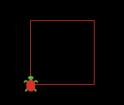

# Aim: Why do we use iterations?
## Objectives:
 * Explain the difference between programming with command center and programming in code tab
 * Construct a square without iteration command
 * Construct a square with iteration command

## NYS COMPUTER SCIENCE AND DIGITAL FLUENCY LEARNING STANDARDS

  * **9-12.CT.8** Develop a program that effectively uses control
    structures in order to create a computer program for practical intent
  * **9-12.IC.7** Investigate the use of computer science in multiple fields.

## Warm Up:  
Time: 5 minutes  
Go to https://ccl.northwestern.edu/netlogo/ and download NetLogo software for
your computer. Skip filling the form and click on Download button right away.

## Introduction:  
Time: 5 minutes  
NetLogo will allow us to create models in Earth Science. We will not be
limited to the virtual labs available on the Internet. If the computer
models are not available to us, we can create a model by writing a NetLogo program.
NetLogo has a command center that allows us to give instructions to the computer
in an interactive manner. NetLogo also has a code editor, where we can write a play,
and the computer will perform the play.

## Lesson Content:  
Time: 10 minutes

Today we will learn how to write a basic NetLogo program.

```
to setup
  clear-all
  create-turtles 1 [
    set shape "turtle"
    set color red
    set size 2
    set heading 0
    pen-down
  ]
end

to go
  ask turtle 0 [
    forward 7
    right 90
  ]
end
```

In this code, a turtle is created when the setup block is called.
When the code block is called, the turtle is asked to move forward 7 steps
and turn to the right 90 degrees.

You can call the setup block by typing its name at the command prompt at the bottom of the screen.

Type this code in your computer's NetLogo editor.



## Lesson Activity  
Time: 15 minutes  

* Give students a few minutes to draw a square.
* Introduce the GUI buttons that can be used to call setup and go blocks.
* Introduce the command called repeat which allows a square to be drawn with one press on the GO button.

Students are challenged to apply what they have learned to draw a triangle.

```
to setup
  clear-all
  create-turtles 1 [
    set shape "turtle"
    set color red
    set size 2
    set heading 0
    pen-down
  ]
end

to go
  ask turtle 0 [
    repeat 4 [
      forward 7
      right 90
    ]
  ]
end
```


## Closing  
Time: 10 minutes
Invite students to show others how to draw a triangle. If they do not know how to draw a triangle, teacher will show that how to draw a triangle.

```

to setup
  clear-all
  create-turtles 1 [
    set shape "turtle"
    set color red
    set size 2
    set heading 0
    pen-down
  ]
end

to go
  ask turtle 0 [
    repeat 3 [
      forward 7
      right 120
    ]
  ]
end
```

## Feedback  
Time: 0 minutes - Homework  
Draw a pentagon

## Explanation

This lesson shows students the power of iteration/loop.
Instead of typing the command multiple times, students can instruct
a computer to repeat a command many times.
