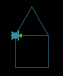

# Aim: How do we use procedures?
## Objectives
 * Apply knowledge of constructing square and triangle to draw a house
 * Apply procedural concept to draw a house
 * Extend the procedural concept to the whole house

## NYS COMPUTER SCIENCE AND DIGITAL FLUENCY LEARNING STANDARDS
 * **9-12.IC.7** Investigate the use of computer science in multiple fields.
 * **9-12.CT.4** Implement a program using a combination of student-defined and third-party functions to  organize the computation.

## Warm Up
Time: 5 minutes  
Teacher asks students to draw a square or a triangle.

## Lesson Content
Time: 20 minutes  

Review how to construct a square and a triangle.
In a square, the turn is 90 degrees. For a triangle, the turn is 120 degrees.


## Lesson Activity  
Time: 15 minutes  

Students are asked to draw a house.

```
to setup
  clear-all
  create-turtles 1 [
    set shape "turtle"
    set color sky
    set size 2
    set heading 90
    pen-down
  ]
end

to go
  ask turtle 0 [
    repeat 4 [
      forward 5
      right 90
    ]
    repeat 3 [
      forward 5
      left 120
    ]
  ]
end
```

After students have successfully drawn a house. Ask them to draw two more
houses. It will take a while and definitely a lot more lines of code.

Teacher introduces the concept of procedure to students to
explain the benefit of procedure which allows pieces of code to be reused
easily.

```
to setup
  clear-all
  create-turtles 1 [
    set shape "turtle"
    set color sky
    set size 2
    set heading 90
    pen-down
  ]
end

to go
  ask turtle 0 [
    square
    triangle
  ]
end

to square
  repeat 4 [
    forward 5
    right 90
  ]
end

to triangle
  repeat 3 [
    forward 5
    left 120
  ]
end
```

Students are asked to extend the procedure concept to the construction of
a house.



## Closing  
Time: 5 minutes  

Review how programming without procedures results in a lot of repetitive pieces of code.
With the use of procedure, a piece of code can be collected in a block. To use
this piece of code, all one has to do is to call the block by invoking its name.
Once again, the purpose of procedure is to allow use to reuse a piece of code.
It also makes a program easier to read and maintain.

```to setup
  clear-all
  create-turtles 1 [
    set shape "turtle"
    set color sky
    set size 2
    set heading 90
    pen-down
  ]
end

to go
  ask turtle 0 [
    house
  ]
end

to house
  square
  triangle
end

to square
  repeat 4 [
    forward 5
    right 90
  ]
end

to triangle
  repeat 3 [
    forward 5
    left 120
  ]
end
```

## Explanation
The lesson is designed for students who will write program in NetLogo to produce
virtual models of Earth Science.
