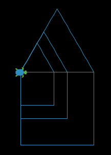

# Aim: Why do we use variables and parameters?
## Objectives
 * Use variables to resize a house
 * Use parameter for a procedure to take input from outside
 * call a procedure with an argument to resize a house

## NYS COMPUTER SCIENCE AND DIGITAL FLUENCY LEARNING STANDARDS
 * **9-12.CT.2** Collect and evaluate data from multiple sources for use in a computational artifact.
 * **9-12.CT.4** Implement a program using a combination of student-defined and third-party functions to  organize the computation.

## Warm Up
Time: 5 minutes  
Teacher asks students to draw a house.

## Lesson Content
Time: 20 minutes  

Students try to  draw a house.
Review how to construct a house with procedures for a square and a triangle.
Introduce the steps for declaring global variable.
Students are asked draw a larger house. Then they will be asked to draw an even
larger house. Then, they will be asked to redraw a house to make it smaller.

```
globals [length-house]

to setup
  clear-all
  create-turtles 1 [
    set shape "turtle"
    set color sky
    set size 2
    set heading 90
    pen-down
  ]
  set length-house 5
end

to go
  ask turtle 0 [
    house
  ]
end

to house
  square
  triangle
end

to square
  repeat 4 [
    forward length-house
    right 90
  ]
end

to triangle
  repeat 3 [
    forward length-house
    left 120
  ]
end
```

## Lesson Activity  
Time: 15 minutes  

Students are introduced to procedure that take inputs as parameters.
Each procedure will have a parameter of side-length.
By changing the value of a global variable, called length-house, a call to
a square procedure will take an input argument, which has a value contained
in the global variable length-house, and draw a square with the size length-house.

```
globals [length-house]

to setup
  clear-all
  create-turtles 1 [
    set shape "turtle"
    set color sky
    set size 2
    set heading 90
    pen-down
  ]
  set length-house 5
end

to go
  ask turtle 0 [
    house
  ]
end

to house
  square 5; length-house
  triangle 5; length-house
end

to square [length-square]
  repeat 4 [
    forward length-square
    right 90
  ]
end

to triangle [length-triangle]
  repeat 3 [
    forward length-triangle
    left 120
  ]
end
```

Students will learn about the GUI interface called slider that allows quick
changes for a variable.

```
;globals [length-house]

to setup
  clear-all
  create-turtles 1 [
    set shape "turtle"
    set color sky
    set size 2
    set heading 90
    pen-down
  ]
  ;set length-house 5
end

to go
  ask turtle 0 [
    house
  ]
end

to house
  square length-from-slider
  triangle length-from-slider
end

to square [length-square]
  repeat 4 [
    forward length-square
    right 90
  ]
end

to triangle [length-triangle]
  repeat 3 [
    forward length-triangle
    left 120
  ]
end
```



## Closing  
Time: 5 minutes  

Students will explain how a variable makes a difference in their work of drawing
houses with different sizes. With a variable, you can make a change in one place
either by changing text or GUI slider, and the computer automatically passes
information to procedures with that variable. Without variables, one has to changes numbers manually in different places. Changing the same values in many places by hand leads to human typing errors and lost productivity.

## Explanation
The lesson is designed for students who will write program in NetLogo to produce
virtual models of Earth Science.
