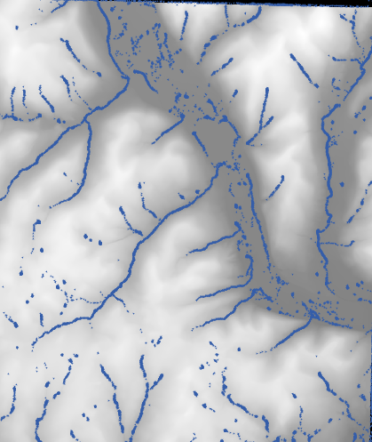

# Aim: How do we show streams on NetLogo?
## Objectives
 * Obtain elevation data from USDA GIS interactive map
 * Input the data from GIS into NetLogo
 * Make use of existing NetLogo model library to create streams on a land.

## NYS COMPUTER SCIENCE AND DIGITAL FLUENCY LEARNING STANDARDS
 * **9-12.IC.7** Investigate the use of computer science in multiple fields.
 * **9-12.CT.4** Implement a program using a combination of student-defined and
   third-party functions to  organize the computation.

## Warm Up
Time: 5 minutes  
Teacher directs students to obtain a tif file from the https://datagateway.nrcs.usda.gov

## Lesson Content
Time: 20 minutes

Teacher walks students through the process of creating asc file and bringing
this GIS data into NeLogo. Teacher asks some students to show how to
import GIS into NetLogo. Teacher then shows students the model library
sample program for GIS gradients.

## Lesson Activity  
Time: 15 minutes
- Students use the sample program called **GIS Gradient Example** in the models library --> Code Examples --> Extension Examples --> gis as a guide to recreate the stream flow for their own selected map.
- Students examine the sample program and write a detailed explanation of
how the sample gradient program works to the best of their abilities.

## Closing  
Time: 5 minutes  

Students show their stream programs on their chosen area, and present
their explanations so far of how the NetLogo gradient streams
program works.

## Explanation
The lesson is designed for students who will write program in NetLogo to produce
virtual models of Earth Science.
