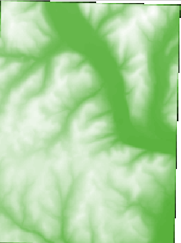
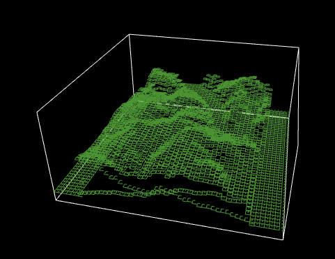

# Project: Visualization of elevation data Map

Options:
- option 1) Build a two-dimensional elevation map
- option 2) Build a three-dimensional elevation map

1)  



2)  



To build a 2-d elevation map, review lesson 7 on
how to obtain GIS elevation data from USDA. Then,
make use of the sample code below:

```
extensions [ gis ]
globals [ elevation-dataset ]

patches-own [patch-elevation]

to setup
  clear-all

  gis:load-coordinate-system "data/elevation/avoca-elevation-layer.prj"
  ;gis:load-coordinate-system "data/elevationUSGS/avoca-layer.prj"

  set elevation-dataset gis:load-dataset "data/elevation/avoca-elevation-layer.asc"
  ;set elevation-dataset gis:load-dataset "data/elevationUSGS/avoca-layer.asc"
  gis:set-world-envelope(gis:envelope-of elevation-dataset)

  let mx gis:maximum-of elevation-dataset

  ask patches [
    set patch-elevation (gis:raster-sample elevation-dataset self)
    ifelse patch-elevation > 0 [
      set pcolor scale-color green patch-elevation 0 mx
    ]
    [ set pcolor white]
  ]
end
```

To build a 3-dimensional elevation map, you can try to
do it on your own with the help of online NetLogo documentations,
or you can use the below sample code as your template:

```
extensions [gis]

globals [elevation-dataset]

patches-own [patch-elevation]

to setup
  clear-all
  gis:load-coordinate-system "data/elevation/avoca-elevation-layer.prj"

  set elevation-dataset gis:load-dataset "data/elevation/avoca-elevation-layer.asc"
  gis:set-world-envelope(gis:envelope-of elevation-dataset)
  ask patches with [pzcor = 0] [
    set patch-elevation int((gis:raster-sample elevation-dataset self)) / 50
    ;print patch-elevation
    sprout 1 [
      setxyz pxcor pycor patch-elevation
      set pitch 0
      set heading 0
      set color green
      pen-down
      forward 0.5
      right 90
      repeat 4 [ forward 0.5 right 90 forward 0.5 ]

      die
    ]
  ]
end
```
